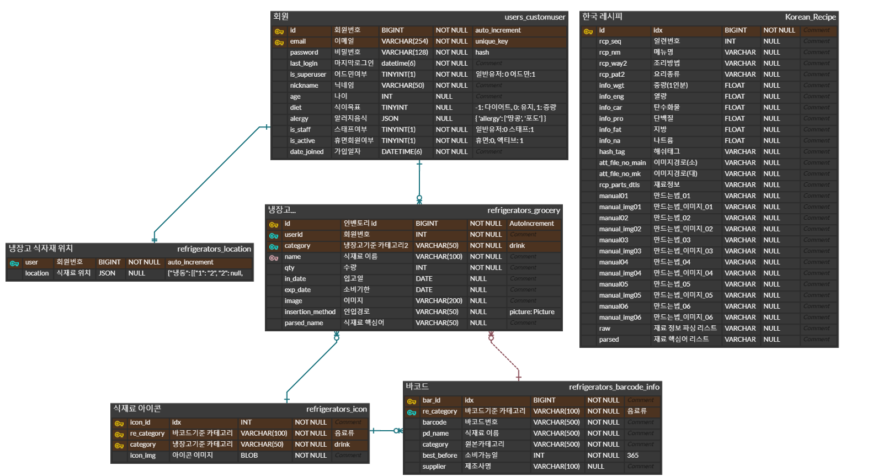

<div align=center style="margin-bottom:30px">
  
</div>

<!--  -->
## 냉장고를 부탁해
[냉Django] 냉장고 식재료 관리 및 레시피 추천 시스템

소비기한 알림과 레시피 추천으로 나의 냉장고 식재료를 똑똑하게 관리해주는 "냉장고 관리 서비스"
<br><br>

> 전체 음식물 쓰레기 중에서 먹고 남은 음식물은 30% 내외다. 그보다 더 많은 음식이나 식재료가 유통/조리과정(57%)에서 버려진다. <u>보관만 하다가 결국 폐기되거나(9%)</u>, <u>하나도 먹지 않은 상태(4%)로 버려지는 경우</u>도 있다.<br>
<i>출처: 전 세계 식재료가 모인 당신의 냉장고 (22.02.08) - 그린포스트코리아(http://www.greenpostkorea.co.kr)</i>

<br>
냉장부의 식재료 소비기한 관리와 레시피 추천 기능을 통해 집에서 환경보호를 실천해보세요 !
<br><br>

## 👑 제공 서비스

- **냉장고 식재료 기반 레시피 추천 서비스:**

    1. 한국 레시피 추천 시스템: 사용자의 냉장고에 있는 식재료로 만들 수 있는 레시피, 소비기한이 임박한 재료를 활용하는 레시피, 사용자가 설정한 알러지 재료를 제외한 레시피를 추천하는 머신러닝 추천 시스템
    2. 해외 레시피 추천 시스템: 냉장고 속 흔한 재료와 새로운 세계 재료들을 조합해 검색하면 해당 재료를 활용한 전세계의 다양한 레시피를 제공하는 추천 시스템
<br><br>

- **식재료 소비기한 관리 서비스:** 냉장고에 소비기한이 임박하거나, 만료가 된 재료가 있는 경우에 페이지 상단에 알림 표시가 되는 기능으로 해당 재료만 필터링해 확인하고 연결 링크를 통해 추가 구매할 수 있는 서비스
- **실제 냉장고 환경과 유사한 식재료 배치:** 냉장고 가계부에서 착안한 냉장고 2D 단면도 상 (냉장, 냉동 칸 구분) 에 식재료를 배치하고 위치를 자유롭게 이동시킬 수 있는 기능. 냉장 칸 자체를 냉동 칸으로 이동 가능
- **다양한 냉장고 식재료 입력 방식:** 냉장고에 식재료를 입력하는 방법으로 직접 입력하는 <b>수기 입력</b>, 사진을 찍으면 AI가 채소 및 과일을 분류해 입력하는 <b>사진 입력 (딥러닝)</b>, 바코드를 찍어  식재료 유통 제품의 정보를 불러와 입력하는 <b>바코드 입력</b> 총 3가지 방식 제공
- **회원 서비스:** 냉장고 서비스를 이용하기 위한 필수 기능으로 회원 가입, 로그인, 회원 정보 수정 기능을 제공. 회원 정보 수정을 통해 나이, 식이 요법, 알러지 재료등을 설정하여 해당 사용자 정보를 냉장고 서비스에 활용 가능. 관리자 문의 페이지를 통해 관리자에게 문의 전달 가능
<br><br>

## 📌 프로젝트 정보
- 멀티캠퍼스 데이터 분석 & 엔지니어 취업 캠프 (python) 23회차
- 기업 요구사항 기반의 문제해결 프로젝트
- 기간: 2023.03.27 ~ 2023.05.10
- 주제: [냉Django] 냉장고 식재료 관리 및 레시피 추천 시스템
- 팀명: 4조 냉장고의 문단속
- 서비스명: 냉장고를 부탁해
- 결과: 최우수상 수상🥇
- PPT: [냉장고를 부탁해 상세 프레젠테이션 파일 (링크)](https://drive.google.com/file/d/1YKxu6dNL_basGfOEwP8P6_nkQ6PrEpWz/view?usp=sharing)

<br>

## 🎥 발표 자료
> [냉장부 최종 발표-1 (링크)](https://drive.google.com/file/d/1ZtnB5hIt2oSLM9TFnMyfbGn5o5GBSRWT/view?usp=drive_link)<br>
>[냉장부 시연 (링크)](https://drive.google.com/file/d/1vuP53lkBDU6arAUSYjg2klwt57bhnNfh/view?usp=sharing)<br>
>[냉장부 최종 발표-2 (링크)](https://drive.google.com/file/d/13Ji334LiHMTx-j94aoQaEDwpaUSklqDt/view?usp=sharing)


<br>


## ⚙ 설치 및 실행 (Local Windows 기준)
[ AWS Architecture는 아래에서 확인 ]

Dependencies (필수 설치 요소)
- Python 3.10 이상 (Django), Python 3.9 이상 (Fastapi, Flask)
- MySQL
- Git

``` bash
## 1. 프로젝트를 저장시킬 폴더 만들고 폴더로 이동 (windows git bash 환경 기준)
## git bash 총 3개 필요 (Django x1, Fastapi x1, Flask x1 실행)
cd c:/myjob/ndjango-local

## 2. 프로젝트 clone(다운 받기)
git clone https://github.com/MultiNDjango/ndjango-django.git

## 3. 프로젝트 환경 설치
##    (mysql root 계정의 비밀번호 입력 후 엔터)
##    a. 프로젝트 가상환경 생성 및 라이브러리 설치
##    b. Django DB 세팅(Migration)
##    c. 필수 데이터 DB 적재
sh ndjango-django/install.sh

## 4. Django 실행 (메인 프로젝트)
sh ndjango-django/run_django.sh

# FastAPI용 bash 창 열기
## 5. FastAPI 실행 (한국 레시피 추천기)
sh ndjango-django/run_fastapi.sh

# Flask용 bash 창 열기
## 6. Flask 실행 (식재료 사진 분류기)
sh ndjango-django/run_flask.sh

## 크롬/엣지 등 인터넷 브라우저 창 열고 URL 접속하여 냉장부 웹사이트 실행
http://127.0.0.1:8000/
```

- 초기에 환경 설치 1회 (install.sh) 한 후에는 재설치 필요 없이 run_django.sh run_fastapi.sh run_flask.sh만 실행
- shell script 없이 실행 -> 가상환경을 activate한 뒤 runserver등 command로 직접 실행 가능

<br>

## 🎀 서버 아키텍처


<br><br>


## 🎃 협업 방식
1. **코드: Git Branch + Pull Request 전략**


- master와 개인 브랜치(6개)로 구성
- 개인 브랜치에서 작업 후 기능 완성 시 pull request로 master에 merge 요청
- master에서 merge (master는 가급적 동작 가능한 버전으로 유지)

2. **진행상황 공유: 개발 문서 활용, 9시 스크럼 회의, 일일수행일지 작성**
- 모든 개발 문서는 Google Docs, ERD Cloud 등 웹베이스 환경(동시 작업 가능)에서 팀원 모두 참여
- [WBS (링크)](https://docs.google.com/spreadsheets/d/1VVad2aCkJsFGlqqegMpESupg2r1wHLDHQsIVMGH9MS4/edit?usp=drive_link)
- [요구사항 정의서 (링크)](https://docs.google.com/spreadsheets/d/19u1Ro9izUVQQzT_KYBjWZcRSE0FC_FBGqxJyTfHyPAU/edit?usp=drive_link)
- [화면 설계 (링크)](https://docs.google.com/presentation/d/1YHjbIK70B25ktkz4k_SY0kYZ8qdcl6idOyDHPfccNtA/edit?usp=drive_link)
- DB 설계: ERD (ERD cloud)
- [코드통합계획표 (링크)](https://docs.google.com/spreadsheets/d/1uh0GB6xB3F-NpN2IilUMU78fSuKwT_xfBGk4uIg79Xw/edit?usp=drive_link)
- [프로젝트 수행일지 (링크)](https://drive.google.com/file/d/1I_p-bGbSdk9i04v2eGTNNpotaQ0MYOu9/view?usp=drive_link)


<br>


## 🍉 기술 스택


<br>

## 🍒 ERD


- Star Schema 기법으로 DB 모델링
- grocery(식재료) Facts Table이 중심에 위치
- icon, barcode_info, customuser등 Dimension Table은 별⭐모양으로 연결

<br>


## 👶 팀원 소개

<table border="" cellspacing="0" cellpadding="0" max-width="2000px">
    <tr width="100%">
        <td align="center"><a href= "https://github.com/jeongdw1001">정다운 (조장)</a></td>
        <td align="center"><a href= "https://github.com/KimKiGUN">김기건</a></td>
        <td align="center"><a href= "https://github.com/seyeon-shijuan">박세연</a></td>
        <td align="center"><a href= "https://github.com/minjilee7">이민지</a></td>
        <td align="center"><a href= "https://github.com/hoopmad">정권영</a></td>
        <td align="center"><a href= "https://github.com/SeYoungMir">최세영</a></td>
    </tr>
    <tr width="100%">
        <td align="center">
          <a href= "https://github.com/jeongdw1001">
            
          </a>
        </td>
        <td align="center">
          <a href= "https://github.com/KimKiGUN">
            
          </a>
        </td>
        <td align="center">
          <a href= "https://github.com/seyeon-shijuan">
            
          </a>
        </td>
        <td align="center">
          <a href= "https://github.com/minjilee7">
            
          </a>
        </td>
        <td align="center">
          <a href= "https://github.com/hoopmad">
            
          </a>
        </td>
        <td align="center">
          <a href= "https://github.com/SeYoungMir">
            
          </a>
        </td>
    </tr>
    <tr width="100%">
      <td align="center">
        <small>
        프로젝트 발표<br>
        회원 기능<br>
        사진 인식 모델(AI)
        </small>
      </td>
      <td align="center">
        <small>
        바코드 데이터<br>
        전처리,DB구축<br>
        냉장고 바코드<br>
        재료 입력
        </small>
      </td>
      <td align="center">
        <small>
        한국 레시피<br>
        추천시스템<br>
        AI서빙, AWS<br>
        인프라구축<br>
        식재료 배치
        </small>
      </td>
      <td align="center">
        <small>
        메인&Contact<br>
        페이지-반응형<br>
        웹사이트 구축<br>
        메일 기능
        </small>
      </td>
      <td align="center">
        <small>
        냉장고수기입력<br>
        식재료소비기한<br>
        알림 서비스 <br>
        사진 인식 입력(AI)
        </small>
      </td>
      <td align="center">
        <small>
        해외 레시피<br>
        추천시스템<br>
        한글,영어혼합<br>
        입력 검색 구현
        </small>
      </td>

   </tr>
</table>

<br>

## ✨ 기능 동작 영상


<div align=center>
  <h3>회원</h3>
</div>

|||
|:-:|:-:|
|||
|1. 메인|2. 관리자 문의|
|||
|3. 회원 가입 및 로그인|4. 회원 정보|

<br>
<div align=center>
  <h3>냉장고</h3>
</div>

|||
|:-:|:-:|
|||
|5. 재료 배치|6. 식재료 등록 (수기 입력)|
|||
|7. 식재료 등록 (사진 입력)|8. 식재료 등록 (바코드 입력)|
|||
|9. 식재료 사진 등록|10. 소비기한 임박/만료 알림|

<br>
<div align=center>
  <h3>추천 시스템</h3>
</div>

|||
|:-:|:-:|
|||
|11. 한국 레시피 추천|12. 해외 레시피 추천|

<br>

## 💀 스켈레톤
- homepage(메인 페이지), users(회원), refrigerators(냉장고), recsys(추천) 4가지 기능으로 구성
- 개별 앱에서도 세부 기능 기준으로 url, model, view, form, serializer 파일 분기 처리
- static 파일(Nginx가 서빙할 정적 파일)은 별도의 파일에 분리
- AI 앱은 별도의 FastAPI 및 Flask로 rest api를 통해 추론 요청/결괏값 통신

```
ndjango/
│
├── requirements.txt      # 필요 패키지
├── manage.py
├── ndjango/
│   ├── __init__.py
│   ├── asgi.py
│   ├── settings.py
│   ├── urls.py
│   └── wsgi.py
│
├── homepage/                       # 개별 앱 (Feature)
├── recsys/
├── users/
├── refrigerators/
│   ├── __init__.py
│   ├── admin.py
│   ├── apps.py
│   ├── templates/                   # HTML 파일
│   │   └── refrigerators/
│   │       ├── icon.html
│   │       └── two_doors.html
│   │
│   ├── individual_urls/             # url
│   │   ├── barcode_insert.py       
│   │   ├── base_urls.py
│   │   ├── crawling_urls.py
│   │   ├── icon_urls.py
│   │   ├── photo_urls.py
│   │   └── table_urls.py
│   │
│   ├── models/                      # model
│   │   ├── __init__.py
│   │   ├── barcode_models.py
│   │   ├── base_models.py
│   │   ├── icon_models.py
│   │   ├── photo_models.py
│   │   └── table_models.py
│   │
│   ├── forms/                 # form
│   │   ├── __init__.py
│   │   ├── barcode_forms.py
│   │   ├── base_forms.py
│   │   ├── icon_forms.py
│   │   ├── photo_forms.py
│   │   └── table_forms.py
│   │
│   ├── serializers/                 # serializer
│   │   ├── __init__.py
│   │   ├── barcode_serializers.py
│   │   ├── base_serializers.py
│   │   ├── icon_serializers.py
│   │   ├── photo_serializers.py
│   │   └── table_serializers.py
│   │
│   ├── tests.py
│   ├── urls.py
│   └── views/                       # view
│       ├── __init__.py
│       ├── barcode_insert.py
│       ├── base_crud.py
│       ├── crawling_insert.py
│       ├── icon_display.py
│       ├── photo_insert.py
│       └── table_display.py
│
├── media/                           # 유저가 업로드 한 파일
└── static/
    ├── homepage/
    ├── recsys/
    ├── refrigerators/               # HTML에 연결되는 정적 리소스
    │   └── icon_display/
    │       ├── header.js
    │       ├── two_doors.css
    │       └── two_doors.js
    └── users/
```

