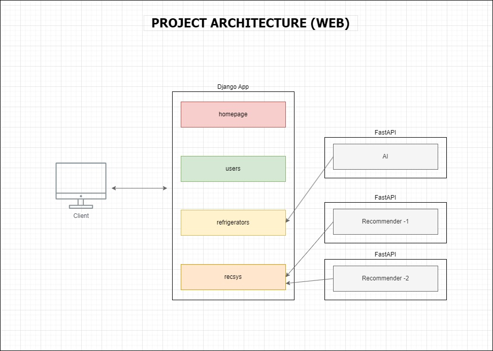

# Ndjango Project Settings

<hr>

## Packages
냉django 프로젝트의 기본 패키지 버전

python version : 3.10

```
asgiref==3.6.0
Django==4.1.7
djangorestframework==3.14.0
mysqlclient==2.1.1
numpy==1.24.2
pandas==1.5.3
python-dateutil==2.8.2
pytz==2023.3
six==1.16.0
sqlparse==0.4.3
tzdata==2023.3
```

<br>


## Django Skeleton(tree)
- 냉django 프로젝트의 소스 트리 구조
- 장고의 MTV 패턴을 적용
- homepage(메인 페이지), users(회원), refrigerators(냉장고), recsys(추천) 4가지 기능으로 구성
- 개별 앱에서도 세부 기능 기준으로 url, model, serializer, view가 분리
- static 파일(Nginx가 서빙할 정적 파일)은 별도의 파일에 분리
- AI 앱은 별도의 FastAPI(or Flask)로 rest api 통신을 통해 추론 요청/결과를 주고받을 예정

```
ndjango/
│
├── requirements.txt      # 필요 패키지
├── manage.py
├── ndjango/
│   ├── __init__.py
│   ├── asgi.py
│   ├── settings.py
│   ├── urls.py
│   └── wsgi.py
│
├── homepage/                       # 개별 앱 (Feature)
├── recsys/
├── users/
├── refrigerators/
│   ├── __init__.py
│   ├── admin.py
│   ├── apps.py
│   ├── templates/                   # HTML 파일
│   │   └── refrigerators/
│   │       ├── icon.html
│   │       └── two_doors.html
│   │
│   ├── individual_urls/             # url
│   │   ├── barcode_insert.py       
│   │   ├── base_urls.py
│   │   ├── crawling_urls.py
│   │   ├── icon_urls.py
│   │   ├── photo_urls.py
│   │   └── table_urls.py
│   │
│   ├── models/                      # model
│   │   ├── __init__.py
│   │   ├── barcode_models.py
│   │   ├── base_models.py
│   │   ├── icon_models.py
│   │   ├── photo_models.py
│   │   └── table_models.py
│   │
│   ├── serializers/                 # serializer
│   │   ├── __init__.py
│   │   ├── barcode_serializers.py
│   │   ├── base_serializers.py
│   │   ├── icon_serializers.py
│   │   ├── photo_serializers.py
│   │   └── table_serializers.py
│   │
│   ├── tests.py
│   ├── urls.py
│   └── views/                       # view
│       ├── __init__.py
│       ├── barcode_insert.py
│       ├── base_crud.py
│       ├── crawling_insert.py
│       ├── icon_display.py
│       ├── photo_insert.py
│       └── table_display.py
│
├── media/                           # 유저가 업로드 한 파일
└── static/
    ├── homepage/
    ├── recsys/
    ├── refrigerators/               # HTML에 연결되는 정적 리소스
    │   └── icon_display/
    │       ├── header.js
    │       ├── two_doors.css
    │       └── two_doors.js
    └── users/
```

<br>

## Project Architecture (django & AI apps)

- 서버 가용성을 고려하여 <b>main Django app, 별도의 AI app으로 구성</b>
<br>




